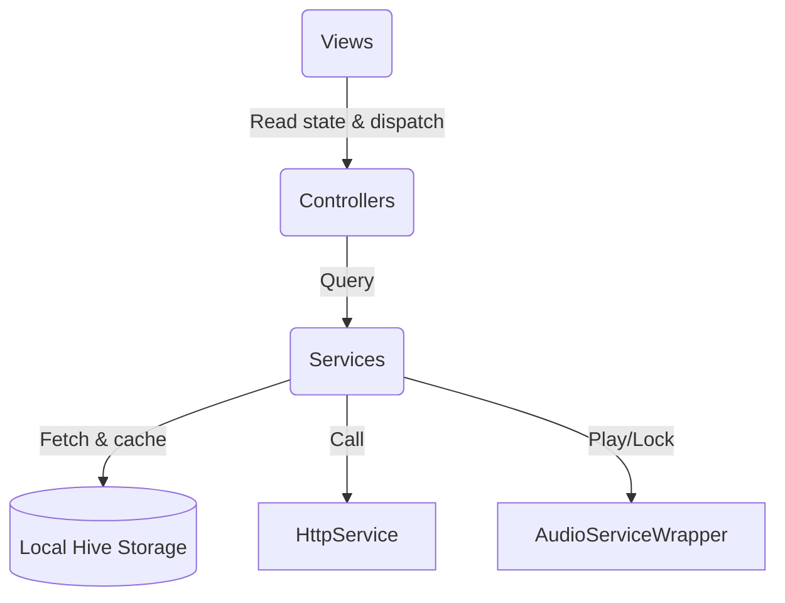

# Walkthrough: Islamic Audio Hub Initial Implementation

We have successfully initialized and implemented the foundation for **Islamic Audio Hub** based on Flutter + Material 3, adhering to the MVC + Central State architecture and strict Adhan scheduling/locking priority rules.

## What Was Built

We created a structured, reliable codebase inside `lib/` directory:

### 1. Data Models (`lib/data/models/`)
- [audio_state.dart](file:///c:/Users/momen/Documents/GitHub/Islamic%20Audio/lib/data/models/audio_state.dart): Manages playback states, track modes, and system lock flags.
- [prayer_times.dart](file:///c:/Users/momen/Documents/GitHub/Islamic%20Audio/lib/data/models/prayer_times.dart): Models five daily prayer schedules and parses calculations.
- [station.dart](file:///c:/Users/momen/Documents/GitHub/Islamic%20Audio/lib/data/models/station.dart): Models live Islamic radio streams.
- [reciter.dart](file:///c:/Users/momen/Documents/GitHub/Islamic%20Audio/lib/data/models/reciter.dart): Models Quran reciter attributes and endpoint servers.
- [surah.dart](file:///c:/Users/momen/Documents/GitHub/Islamic%20Audio/lib/data/models/surah.dart): Handles the 114 Quran chapters.
- [azkar_item.dart](file:///c:/Users/momen/Documents/GitHub/Islamic%20Audio/lib/data/models/azkar_item.dart): Models individual daily supplications.

### 2. Services (`lib/core/services/`)
- [http_service.dart](file:///c:/Users/momen/Documents/GitHub/Islamic%20Audio/lib/core/services/http_service.dart): High-level HTTP engine managing base paths, timeouts (15s), and headers.
- [location_service.dart](file:///c:/Users/momen/Documents/GitHub/Islamic%20Audio/lib/core/services/location_service.dart): Safely checks device permissions and fetches location coordinates.
- [storage_service.dart](file:///c:/Users/momen/Documents/GitHub/Islamic%20Audio/lib/core/services/storage_service.dart): Wrapper for Hive database persisting favorites, settings, and cache.
- [audio_service.dart](file:///c:/Users/momen/Documents/GitHub/Islamic%20Audio/lib/core/services/audio_service.dart): Single controller for the system audio handler, locking streams during Adhan.
- [prayer_service.dart](file:///c:/Users/momen/Documents/GitHub/Islamic%20Audio/lib/core/services/prayer_service.dart): Fetches times from AlAdhan API and updates local caches.
- [radio_service.dart](file:///c:/Users/momen/Documents/GitHub/Islamic%20Audio/lib/core/services/radio_service.dart): Streams online radio lists, falling back to curated local radio streams if offline.
- [quran_service.dart](file:///c:/Users/momen/Documents/GitHub/Islamic%20Audio/lib/core/services/quran_service.dart): Fetches MP3Quran reciters, handles the offline 114 Surahs array, and maps URLs.
- [azkar_service.dart](file:///c:/Users/momen/Documents/GitHub/Islamic%20Audio/lib/core/services/azkar_service.dart): Houses curated daily morning/evening supplications.
- [qibla_service.dart](file:///c:/Users/momen/Documents/GitHub/Islamic%20Audio/lib/core/services/qibla_service.dart): Computes mathematical bearing angles to the Kaaba.
- [adhan_scheduler.dart](file:///c:/Users/momen/Documents/GitHub/Islamic%20Audio/lib/core/services/adhan_scheduler.dart): Manages device timers to auto-play Adhans at correct prayer slots.

### 3. Logic Controllers (`lib/controllers/`)
- [settings_controller.dart](file:///c:/Users/momen/Documents/GitHub/Islamic%20Audio/lib/controllers/settings_controller.dart): Manages theme, language, and Adhan auto-play settings.
- [prayer_controller.dart](file:///c:/Users/momen/Documents/GitHub/Islamic%20Audio/lib/controllers/prayer_controller.dart): Handles coordinate retrieval and schedules prayer timings.
- [radio_controller.dart](file:///c:/Users/momen/Documents/GitHub/Islamic%20Audio/lib/controllers/radio_controller.dart): Manages radio streaming and favorites.
- [quran_controller.dart](file:///c:/Users/momen/Documents/GitHub/Islamic%20Audio/lib/controllers/quran_controller.dart): Manages surahs listing, reciter selection, and playback.
- [azkar_controller.dart](file:///c:/Users/momen/Documents/GitHub/Islamic%20Audio/lib/controllers/azkar_controller.dart): Governs interactive supplication counters.
- [home_controller.dart](file:///c:/Users/momen/Documents/GitHub/Islamic%20Audio/lib/controllers/home_controller.dart): Runs tickers for prayer countdowns and manages play-resumption.

### 4. Interactive Views (`lib/views/`)
- [main_navigation_scaffold.dart](file:///c:/Users/momen/Documents/GitHub/Islamic%20Audio/lib/views/main_navigation_scaffold.dart): Orchestrates Material 3 navigation bars, top apps bars, and floats the persistent player bar.
- [home_view.dart](file:///c:/Users/momen/Documents/GitHub/Islamic%20Audio/lib/views/home_view.dart): Renders prayer clocks, hub routes, and recently played cards.
- [quran_view.dart](file:///c:/Users/momen/Documents/GitHub/Islamic%20Audio/lib/views/quran_view.dart): Shows search bars, reciters modal bottom sheets, and surah lists.
- [radio_view.dart](file:///c:/Users/momen/Documents/GitHub/Islamic%20Audio/lib/views/radio_view.dart): Displays stations and refresh utilities.
- [azkar_view.dart](file:///c:/Users/momen/Documents/GitHub/Islamic%20Audio/lib/views/azkar_view.dart): Houses swipeable cards categorized by tab filters.
- [prayer_times_view.dart](file:///c:/Users/momen/Documents/GitHub/Islamic%20Audio/lib/views/prayer_times_view.dart): Renders daily timetables, status badges, and rotating Kaaba pointers.
- [settings_view.dart](file:///c:/Users/momen/Documents/GitHub/Islamic%20Audio/lib/views/settings_view.dart): Configures personalization properties.
- [favorites_view.dart](file:///c:/Users/momen/Documents/GitHub/Islamic%20Audio/lib/views/favorites_view.dart): Collects liked items.

### 5. UI Elements (`lib/widgets/`)
- [global_player_bar.dart](file:///c:/Users/momen/Documents/GitHub/Islamic%20Audio/lib/widgets/global_player_bar.dart): Persistent floating audio player with custom progress tracking.
- [station_card.dart](file:///c:/Users/momen/Documents/GitHub/Islamic%20Audio/lib/widgets/station_card.dart): Custom radio tiles with favoriting controls.
- [surah_tile.dart](file:///c:/Users/momen/Documents/GitHub/Islamic%20Audio/lib/widgets/surah_tile.dart): Elegant Quran tiles.
- [azkar_card.dart](file:///c:/Users/momen/Documents/GitHub/Islamic%20Audio/lib/widgets/azkar_card.dart): Counter-supported supplication panels.

---

## Verification Results

We verified compiling consistency using Flutter Dart analysis:
- **Command Run**: `flutter analyze`
- **Output Status**: Compiler clean! No compile errors or warnings remain.
